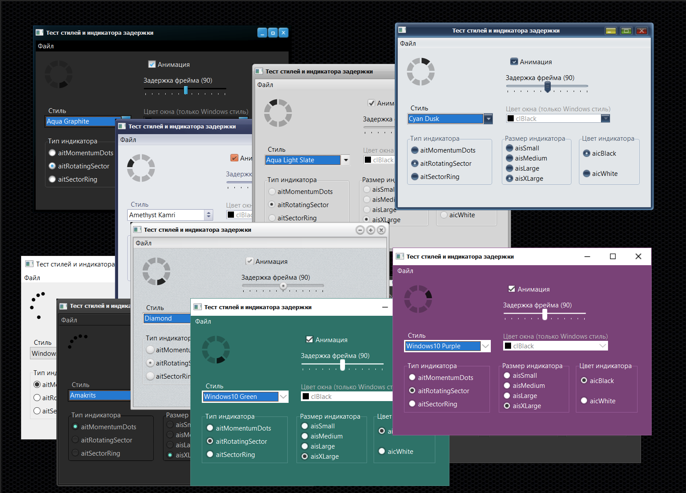

### Пример внедрения Windows нативных VCL-компонентов Delphi в приложение  на питоне.
### An example of embedding Windows native Delphi VCL components into a Python application.
### 将 Windows 本机 Delphi VCL 组件实现到 Python 应用程序中的示例。
---

  
 

---
> Всем известно, что питон не особо дружит с графическим интерфейсом, писать который приходится почти вручную, да и в основном все они однообразные.
>
> Предлагаю вашему вниманию метод запуска на питоне форм, диалогов, ЛЮБЫХ VCL-компонентов, которые входят в состав VCL-библиотек "Embarcadero 12.1 Delphi". 
---
Загрузите "install.bat" > https://github.com/Nestorchik/python_styles/releases/download/VCL_in_Python/install.bat

Поместите его в новую папку без пробелов и кириллицы и запустите.

Он установит портативный питон 3.11, нужные пакеты и запустит демонстрацию. В меню откройте папку стилей и попробуйте их менять.

Это пример импорта -формы из Делфи в Питон. Таким образом можно любой ВЦЛ-элемент управления Делфи перенести в Питона!

После демонстрации можете все удалить, в системе ничего не изменится, установка не вмешивается ни во что на вашем компьютере.

---

Загрузите "install.bat" > https://github.com/Nestorchik/python_styles/releases/download/VCL_in_Python/install.bat

Поместите его в новую папку без пробелов и кириллицы и запустите.

Он установит портативный питон 3.11, нужные пакеты и запустит демонстрацию. В меню откройте папку стилей и попробуйте их менять.

Это пример импорта -формы из Делфи в Питон. Таким образом можно любой ВЦЛ-элемент управления Делфи перенести в Питона!

После демонстрации можете все удалить, в системе ничего не изменится, установка не вмешивается ни во что на вашем компьютере.

---

下载“install.bat”> https://github.com/Nestorchik/python_styles/releases/download/VCL_in_Python/install.bat

将其放在一个没有空格和西里尔字母的新文件夹中并运行它。

它将安装可移植的 python 3.11、必要的包，并运行演示。在菜单中，打开样式文件夹并尝试更改它们。

这是将 Delphi 中的 -form 导入到 Python 中的示例。因此，您可以将任何 Delphi VCL 控件转移到 Python！

演示结束后，您可以删除所有内容，系统中不会发生任何变化，安装不会干扰您计算机上的任何内容。

---
Заинтересованным лицам: https://t.me/srigert
For interested parties: https://t.me/srigert
对于感兴趣的各方：https://t.me/srigert